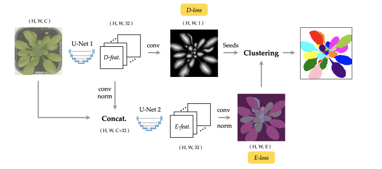

# Reproduce Project
## Paper name : Improving Pixel Embedding Learning through Intermediate Distance Regression Supervision for Instance Segmentation (ECCVW 2020)

[[`arxiv`](https://arxiv.org/abs/2007.06660)]

<div align="center">
    
</div></br>

This project provides an reproduce of paper "Improving Pixel Embedding Learning through Intermediate Distance Regression Supervision for Instance Segmentation" based on Pytorch.
It referred [instance_segmentation_with_pixel_embeddings](https://github.com/looooongChen/instance_segmentation_with_pixel_embeddings).


## Training
To train a model with 2 GPUs, run:
```bash
cd /path/to/detectron2
python3 train.py --cfg <config.yml> --pickle-path 'data/train.pickle' --exp-name 'exp'  --device '0,1' -- batch-size 8
```
Pickle file us used to organize the required data paths for each input image. You can refer the way of making pickle file in 'utils/make_pickle.py'.
